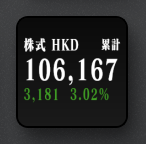

# Futu Portfolio for UlanziDeck

<p align="center">
  
</p>

Shows your [Futu](https://www.futunn.com/) / [Moomoo](https://www.moomoo.com/) portfolio worth and gain/loss on an [UlanziDeck](https://www.ulanzi.com/) key.

The key uses a dark ticker layout:

- **Top:** `株式` plus currency (`HKD`, `USD`, …), and `今日` / `累計`
- **Middle:** total net assets (converted to the selected currency)
- **Bottom:** gain/loss in the selected currency (USD and other P&L are converted to HKD/USD/… with OpenD’s FX, then summed)

Tap the key to switch between **today's P&L** (`今日`) and **total unrealized P&L** (`累計`).

This plugin does **not** talk to Futu’s servers by itself. It reads your account from **OpenD**, Futu’s local API gateway, running on your computer.

## What is OpenD?

[OpenD](https://openapi.futunn.com/futu-api-doc/quick/opend-base.html) is the official Futu OpenAPI gateway app.

Futu’s trading APIs are not a public HTTP endpoint you call from the internet. Instead:

```text
UlanziDeck plugin  →  OpenD on this computer (127.0.0.1:11111)  →  Futu / Moomoo
```

- OpenD logs into your Futu / Moomoo account.
- Other programs on the same machine (this plugin, Python scripts, etc.) connect to OpenD’s local API port.
- Default API address: **`127.0.0.1:11111`**

You need a Futu or Moomoo brokerage account. OpenD is free for customers with that account.

Official intro and GUI setup: [Visualization OpenD](https://openapi.futunn.com/futu-api-doc/quick/opend-base.html)  
English: [Visualization OpenD (EN)](https://openapi.futunn.com/futu-api-doc/en/quick/opend-base.html)

## Install OpenD

Follow Futu’s GUI OpenD path (easier than the command-line build). Details and screenshots live on the page above.

### 1. Download

OpenD runs on **Windows, macOS, CentOS, and Ubuntu**.

Download the GUI package from:

- [Futu OpenAPI downloads](https://www.futunn.com/en/download/OpenAPI)
- [Help Center: Download Futu OpenD](https://support.futunn.com/en/topic464)

Get **OpenD** (the gateway), not only a language SDK such as `futu-api`.

### 2. Install and run

1. Unzip the download.
2. Run the installer for your OS.
3. On Windows, OpenD usually installs under `%appdata%`.
4. Launch **Visualization OpenD** (the windowed app).

Keep OpenD running in the background whenever you want this UlanziDeck key to update.

### 3. Configure the API port

On the right side of the OpenD window, set:

| Setting | Value this plugin expects |
| --- | --- |
| **IP** / listen address | `127.0.0.1` |
| **Port** / listen port | `11111` |

Leave the listen address on localhost unless you know you need remote access. If you bind to a non-local address, Futu requires an RSA private key before trading APIs will work. This plugin only needs the local API.

You do not need to change WebSocket / Telnet settings for this plugin.

### 4. Log in

1. Enter your Futu / Moomoo account and password.
2. First login: complete Futu’s questionnaire and agreements, then log in again.
3. After a successful login you should see your account info and quote rights.

### 5. Confirm it is listening

On the machine running OpenD, port **11111** should be open on `127.0.0.1`. If the UlanziDeck key shows `OpenD?`, OpenD is not running, not logged in, or not on `127.0.0.1:11111`.

## Install this UlanziDeck plugin

1. Install and log into OpenD as above.
2. Copy `com.raykira.futuportfolio.ulanziPlugin` into your UlanziDeck `Plugins` folder (or clone this repo there).
3. In the plugin folder run `npm install`.
4. Restart UlanziDeck.
5. Add **Futu Portfolio** to a key.

### Settings

- OpenD host and port (default `127.0.0.1:11111`)
- Real or simulate environment
- Display currency
- Optional account ID (leave blank to auto-pick the universal securities account)
- Refresh interval

## More OpenD docs

- [What OpenD is and GUI setup](https://openapi.futunn.com/futu-api-doc/quick/opend-base.html)
- [Command-line OpenD](https://openapi.futunn.com/futu-api-doc/en/opend/opend-cmd.html)
- [Futu OpenAPI home](https://openapi.futunn.com/)
